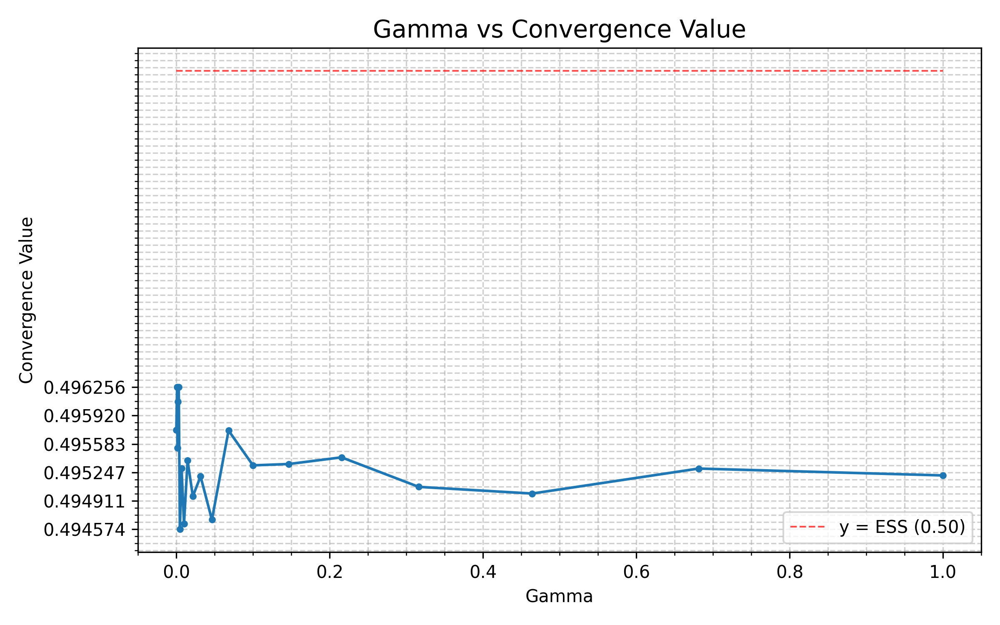

# **QDrift: Learning in the Snow**

### [Github link](https://github.com/icingtea/qdrift)

## **Introduction**

The *Snowdrift Game* is a classic two-player, two-strategy social dilemma.
A common analogy: two drivers are trapped by a snowdrift. Each can either:
- **Cooperate (C)** by shovelling  
- **Defect (D)** by staying in the car

Depending on their choices, each player receives a **payoff**:
- If both cooperate, they share the work and each gets a moderate reward.
- If one cooperates while the other defects, the defector enjoys full benefit while the cooperator bears the whole cost.
- If both defect, no one gets through and both receive the lowest payoff.

The Snowdrift Game has a **mixed Evolutionarily Stable Strategy (ESS)**.
A general payoff matrix for the game can be drawn up:

|       | C                      | D            |
| ----- | ---------------------- | ------------ |
| **C** | (b - c / 2), (b - c / 2) | (b - c), b |
| **D** | b, (b - c)           | 0, 0     |

where:
- `b` = benefit of clearing the drift
- `c` = total cost of clearing the drift

Here, there are two clear Nash Equilibriums. Using the replicator dynamics equation: `f'_i = f_i(E_i - E)`, we can say that at the ESS point, a population of vanilla Snowdrift players will have the following proportion of cooperators:

```
n(c) = (b - c) / (b - c / 2)
```

Because of that interior equilibrium, the Snowdrift Game is the perfect testing ground for learning dynamics that might approximate replicator-style behaviour without explicit equations. The goal of this project is to explore *multi agent* classical AI/annealing/learning-based approaches to the Snowdrift game.

---

## **Introduction to Q-Learning**

**Q-Learning** is a model-free reinforcement learning algorithm.
An agent maintains a table Q(a) estimating the expected return for taking action a belonging to the action space.
After receiving reward r_t, the update rule is:

```
Q_t+1(a_t) = Q_t(a_t) + α_t * (r_t + gamma * max_a' Q_t(a') - Q_t(a_t))
```

where:

* `α_t` — learning rate
* `gamma` — discount factor for future rewards

Action selection uses an **ε-greedy** policy:

* With probability `1 - ε_t`: exploit (choose argmax Q)
* With probability `ε_t`: explore (choose random action)

Q-learning is a simple way for agents to learn how to behave through experience. 
- Each possible action has a "Q-value," which represents how good that action has been in the past. 
- After every interaction, the agent adjusts its Q-values based on the reward it just received such that actions that lead to better outcomes get higher scores. 
- Over time, by mostly repeating high-value actions but occasionally exploring new ones, the agent learns which behavior works best in its environment.

Essentially:

**ε (epsilon): the exploration rate.**

- With probability ε, the agent tries a random action instead of the best-known one.
- High ε = more exploration (good early on).
- As ε decays, behavior becomes more predictable and exploitative.

**γ (gamma): the discount factor.**

- Determines how much future rewards matter compared to immediate ones.
- γ = 0: agent only cares about instant payoff.
- γ close to 1: agent values long-term returns.
- In one-shot games like Snowdrift, γ is usually 0.

**α (alpha): the learning rate.**

- Controls how strongly new experiences update old values.
- Small α = slow, steady learning (averages out noise).
- Large α = fast, reactive learning but less stable.

As learning progresses, both α and ε decay, letting exploration fade and Q-values converge to steady expectations.

---

## **3. Why the Snowdrift Game via Q-Learning**

I chose the Snowdrift Game because its **mixed ESS** makes it a fitting test for RL dynamics.
In games with pure equilibria, learners simply converge to a corner (all C or all D).
Here, equilibrium requires a *balance* between C and D.
The implementation of Q-Learning for this project is easily modifiable to analyze other two-player, two-strategy games.

Intuitively, Q-Learning approximates the *replicator equation* in expectation:
- If agents play against the population, receive rewards, and update their Q-values proportionally to payoff differences, the population frequencies evolve similarly to a probabilistic discretely represented version of replicator dynamics.
- Thus, with suitable exploration and slow learning, the aggregate behaviour of many Q-learners should hover around the mixed ESS.

---

## **4. Implementation Details**

### **4.1 Project Structure**

The codebase is modular:

```
src/
 ├── agent.py        # Player class with Q-table and update logic
 ├── sandbox.py      # Main simulation environment
 ├── models.py       # Dataclasses for configs, payoffs, parameters
 ├── main.py         # CLI entry point (argparse, TOML loading)
 └── results/        # Saved runs and figures
```

### **4.2 Configuration**

All parameters are stored in a TOML file (`config.toml`), e.g.:

```toml
[simulation]
ε = 0.5
α = 0.01
gamma = 0
α_decay_rate = 0.9999
ε_decay_rate = 0.9999
points = 100
```

Using TOML keeps experiments reproducible and editable without touching code.

### **4.3 CLI & Modularity**

`main.py` uses `argparse` to specify:

* `--paramtest α` or `--paramtest ε`
* `--n` (number of agents)
* `--gaussian`, `--sigma`, `--points`, `--save_runs`, etc.

All simulation runs funnel through a single **`Sandbox`** class, which handles initialization, looping, and plotting.

### **4.4 Multiprocessing**

For parameter sweeps, the code employs `multiprocessing.Pool` to parallelize multiple sandbox instances.
Each worker reads the TOML config and writes back convergence results.
This massively speeds up parametric plots.
I have future plans to rewrite this project in C++/Rust to take better advantage of threading, considering `multiprocessing` involves huge overheads via `fork()` syscalls and child process creation.

### **4.5 Graphing**

Graphs are produced with Matplotlib:

* convergence lines over time,
* parameter trend plots (log-scale),
* and annotated equilibrium points.

The display functions automatically scale axes and mark the ESS line.

---

## **5. Project-Specific Mechanics**

### **5.1 Sandbox Structure**

Each simulation step:

1. Randomly **shuffles agents** (`np.random.permutation`)
2. Pairs them for interactions (like a random matching in evolutionary games)
3. Each pair plays the Snowdrift payoff matrix and updates Q-values.

This shuffling makes sure agents face diverse opponents and approximates a well-mixed population, to give agents an unbiased chance at converging to ESS.

### **5.2 Learning & Decay**

Each agent tracks its own:

* Q_C and Q_D
* α_t and ε_t

After each move (which occurs once per agent per episode):
```
α_{t+1} = α_t * α_decay_rate
ε_{t+1} = ε_t * ε_decay_rate
```

The decay schedule is multiplicative but slow (0.9999), giving long transients that let the system stabilize.

### **5.3 Convergence Metric**

At each global timestep, we record the **fraction of cooperators** x_t.
Convergence value x_N is defined as the mean of x_t over the fraction of timesteps where ε < threshold value.

That value is compared to the theoretical ESS from payoff parameters.

---

## **6. Observations**

With small populations, ex: n < 100, convergence values bounced erratically because random pairings and exploration noise dominated.
As the number of agents increased, unpredictability shrank, and the average cooperator fraction **approached the ESS** closely.

**Configuration that achieved stable convergence:**

```toml
[simulation]
epsilon = 0.5
alpha = 0.01
gamma = 0
alpha_decay_rate = 0.9999
epsilon_decay_rate = 0.9999
```

### **6.1 Intuition for These Values**

* **ε = 0.5:** strong early exploration ensures the system doesn't collapse into extreme proportion values.
* **α = 0.01:** small enough to not create erratic curves while not being restrictive to learning.
* **γ = 0:** only immediate payoffs matter (suitable for a one-shot symmetric game).
* **α, ε decay = 0.9999:** extremely slow decay encourages early exploration and stable convergence, therefore letting expectations settle before freezing learning.

### **6.2 Example Runs and Parameter Analysis**

#### **Convergence to ESS with Different Payoff Structures**

The simulation demonstrates robust convergence to the theoretical ESS across different payoff configurations:

* **For B = 3, C = 2** (ESS = 0.67):
  
  
  The system converges to approximately 0.65-0.67 cooperators, closely matching the predicted ESS of (3-2)/(3-1) = 0.67. The initial spike to ~75% cooperation represents the exploration phase, after which the population stabilizes around the mixed equilibrium. The Gaussian smoothed curve clearly shows convergence by step ~40,000, with minimal drift thereafter.

* **For B = 4, C = 2** (ESS = 0.50):
  
  
  Here the ESS predicts equal mixing: (4-2)/(4-1) = 0.50. The simulation converges accurately to this value, showing that when the cost is exactly half the benefit, agents learn to cooperate exactly 50% of the time. The convergence is faster than the B=3, C=2 case, likely because the equal-mixing equilibrium is more stable under random perturbations.

Both runs demonstrate that Q-learning successfully approximates evolutionary dynamics, with the population frequency matching game-theoretic predictions within ~2-3% error.

---

#### **Effect of Epsilon Decay Rate**


**Insight**: The epsilon decay rate must be slow enough to allow thorough exploration of the strategy space, but must eventually decay to near-zero to allow the population to settle at ESS. The sweet spot appears to be around **0.9999**, which provides ~20,000-40,000 steps of meaningful exploration before locking in.

---

#### **Critical Role of the Discount Factor (Gamma)**



**Insight**: Gamma does not seem to affect ESS convergence very much, which is consistent with the fact that in this setup, each interaction is independent of all the others. The exception is at *1*, where the population seems to tend toward cooperation (likely due to considering phantom future values).

#### **Summary of Parameter Sensitivity**

| Parameter | Optimal Value | Effect When Suboptimal |
|-----------|---------------|------------------------|
| **γ (gamma)** | 0.0 | Creates phantom future value |
| **ε decay** | 0.9999 | Too slow: perpetual exploration; Too fast: premature convergence to suboptimal strategies |
| **α (alpha)** | 0.01 | Too high: oscillations; Too low: extremely slow convergence |
| **α decay** | 0.9999 | Must match ε decay to maintain stable learning as exploration decreases |

---

## **7. Discussion**

This experiment shows that **Q-Learning can recover mixed ESS behaviour** in large stochastic populations.
The mismatch between small-n runs and ESS predictions comes directly from sampling noise, random pairing, and asynchronous decays — all of which vanish in the mean-field limit.

The final dynamics resemble a noisy discretization of the replicator equation:

x_{t+1} - x_t ≈ α_t · x_t(1-x_t) · (f_C - f_D) + noise

As n and 1/α_t grow, the noise term shrinks, and x_t → x*.

---

## **8. Conclusion**

By embedding Q-Learning agents in a Snowdrift Game environment, we can simulate how individual learning processes collectively reproduce evolutionary stability.
With suitable learning parameters and large populations, the system's average behaviour converges closely to the analytical ESS predicted by game theory.